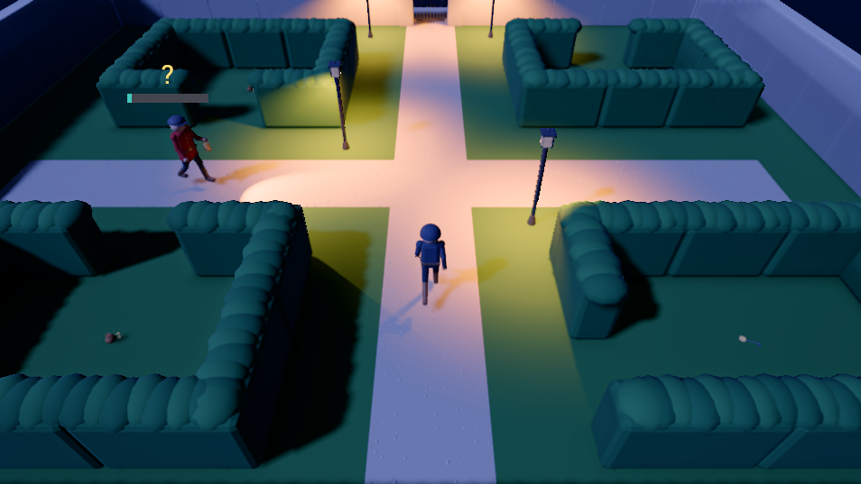
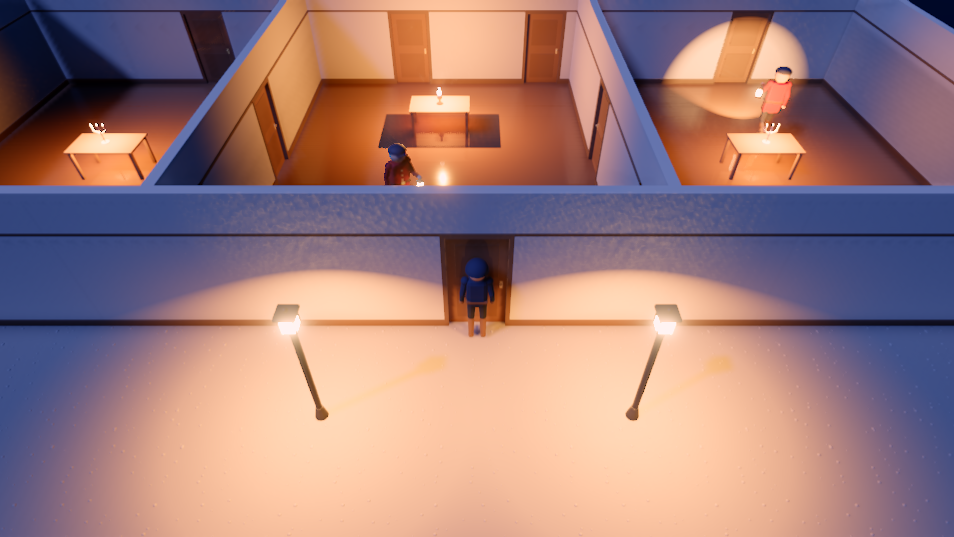
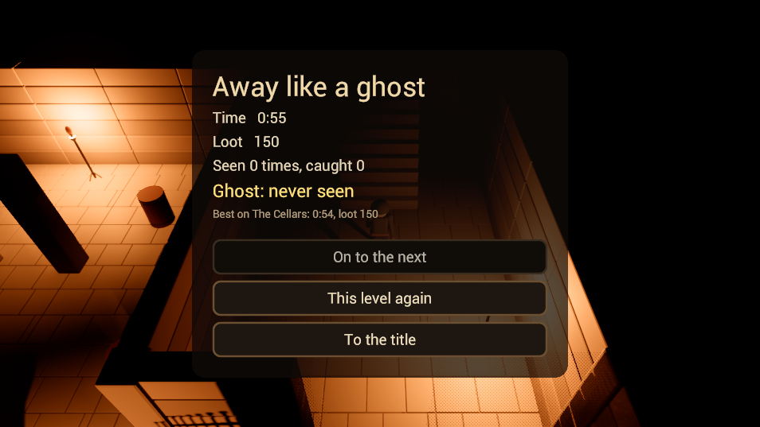

# Game Engine

[](https://discord.gg/WSvxW8mWH5)
[](LICENSE)

A game engine in C++23, built on modules throughout, with the editor, asset pipeline and tools to
take a game from first scene to shipped build: a project made in the editor exports to a desktop
player, to the browser (WebGPU through Emscripten) and to the Steam Deck. Underneath are a layered
runtime over an abstract RHI with Vulkan, WebGPU and Direct3D 12 backends; a render graph driving
forward PBR with shadows, image-based lighting and a full post stack; physics, navigation, audio,
skeletal animation with graphs and IK, terrain and vegetation; gameplay scripting in AngelScript
or Luau; and a CSS-styled UI framework.

It is built to be worked by agents as well as people. An MCP host exposes the engine's
reflection, its script API, project operations and play in editor, and the four sample games in
this repository were each built and playtested through those tools, then shipped to the web and
the Steam Deck.


## What is here

**Rendering.** A render graph over the RHI: forward PBR with a depth prepass and clustered
lights; cascaded sun shadows and shadowed point and spot lights; image-based lighting and
reflection probes; decals, sprites, particles, skinned and instanced meshes, terrain and
vegetation; render textures for in-game cameras; and a post stack with ambient occlusion, SSR,
screen-space GI, bloom, TAA, MSAA, FXAA, auto exposure and colour grading. A game's look is set
once in shared environment and post profiles. Vulkan 1.3 is the primary desktop backend; WebGPU
runs on the desktop through wgpu-native and in the browser as itself; Direct3D 12 runs on
Windows. Shaders are HLSL, compiled through DXC, cross compiled to WGSL for the web, and cooked
into packs.

**Scene and engine.** Entities with hierarchical transforms, component managers per domain,
prefabs with overrides, scene serialization, and the subsystems a game needs: physics (Jolt),
navigation (Recast/Detour), audio (miniaudio, buses with effect chains), animation (skeletal
clips, animation graphs, IK, root motion, property animation), particles, splines, terrain and
vegetation, input maps, save data, networking with state replication, and world-space UI.

**Scripting.** Gameplay code in AngelScript or Luau over the engine's reflected script facades:
behaviours per entity, a level script per scene, a game script per run, coroutines and events,
with a debugger in the editor. See [Documentation/Shipping/Scripting.md](Documentation/Shipping/Scripting.md).

**Editor.** A project manager, scene hierarchy, a viewport with gizmos and per-domain tools
(terrain sculpting and painting, vegetation, spline editing), inspectors from reflection, an
asset browser over the import and cook pipeline, undo and redo, play in editor (several
instances side by side), and a page per asset type: materials, meshes, textures, fonts, audio,
animation clips and graphs, particles, input maps, UI documents and themes, render profiles, and
scripts.

**Pipeline and shipping.** Importers (glTF, FBX and OBJ, images, audio, fonts), cooks per asset
type, texture compression (BC7, ASTC), and an export that packages a project for the desktop
player, the web or the Steam Deck from per-target presets and player templates; headless tools
do all of it from the command line.

**UI.** A retained view tree with flex, dock, grid and flow layouts, `.sml` markup and `.sss`
stylesheets with a cascade, transitions and themes, keyboard and gamepad navigation, a game UI
kit (menus, bars, prompts, toasts), a vector graphics layer with SVG, distance field and coverage
fonts, and an editor toolkit (docking, property grids, colour pickers, curve and gradient
editors, a node graph canvas).

**Agent tooling.** An MCP host (`Tools.Mcp`) exposes the engine's reflection, the script API and
project operations (import, cook, scene validation, export, health checks); the editor serves
the same tools over HTTP for its open project, plus its pages and play in editor, where an agent
plays the game with scripted input and reads back probes and screenshots.
[AGENTS.md](AGENTS.md) is how an agent works on the engine itself.

## Building

Requirements:

- CMake 3.28+ and Ninja.
- Linux x64: Clang 17+ and/or GCC 15+ (both are kept green; Clang is the daily driver), the
  Vulkan development libraries, and SDL3's build dependencies. On Ubuntu or Debian:

  ```
  sudo apt install cmake ninja-build clang pkg-config \
      libvulkan-dev vulkan-tools vulkan-validationlayers mesa-vulkan-drivers \
      libx11-dev libxext-dev libxrandr-dev libxcursor-dev libxi-dev libxss-dev \
      libxtst-dev libwayland-dev wayland-protocols libxkbcommon-dev libasound2-dev
  ```

- Windows x64: Clang 17+ (LLVM) or MSVC, and the Windows SDK. The MSVC presets run from a
  Developer Command Prompt (vcvars64), so `cl.exe` and the SDK are on the path.
- A Vulkan 1.3 (or, on Windows, D3D12) capable GPU to run anything that draws.
- For web builds, emsdk 6.0.5 with the project's response file patch applied; see
  [Documentation/Guides/emscripten-windows.md](Documentation/Guides/emscripten-windows.md).

Everything goes through CMake presets; outputs (executables, cooked shader packs, runtime
sidecars) land in `Bin/<Config>/<Platform>-<Compiler>/`, e.g. `Bin/Debug/Linux64-Clang/`.

```
cmake --preset clang                  # or gcc; clang-release, clang-shipping, wasm, ...
cmake --build --preset clang
ctest --preset clang                  # the unit and integration tests
```

| Preset | Meaning |
|---|---|
| `clang` / `gcc` / `msvc` | Debug, the development configuration |
| `clang-shared` / `msvc-shared` | Debug with shared libraries |
| `clang-reldbg` | RelWithDebInfo, for performance work |
| `clang-release` / `gcc-release` | Release |
| `clang-shipping` / `gcc-shipping` | Shipping (no asserts, stripped) |
| `wasm` / `wasm-shipping` | Emscripten wasm32 |

Running the editor:

```
Bin/Debug/Linux64-Clang/Tools.Editor               # the project manager
Bin/Debug/Linux64-Clang/Tools.Editor <projectDir>  # open a project
```

Add `--mcp` to serve the open project to an agent over MCP while you work in the editor.

## Sample projects

Game projects under `Data/SampleProjects/`, opened from the editor's project manager. The four
games are built through the engine's MCP tools and ship to the web and the Steam Deck;
[GameEngineDemos](https://jayrulez.github.io/GameEngineDemos/) plays them in a browser.

**Sky Hopper** (`PlatformerGame`) is a small 3D platformer, played through to the end over the
MCP tools by an AI agent while it was built: five levels, coins, enemies and hazards, three lives
with stars and best scores saved, menus with volume settings, music and effects, and gamepad
support throughout.

| Title | Level 1 | Settings |
|:---:|:---:|:---:|
|  |  |  |

**PaperKid** is an arcade paper-route game: five town blocks on a difficulty ramp, papers thrown
with a soft auto-aim, traffic and pedestrians on the navmesh, lives, a live minimap drawn by a
top-down camera into a render texture, particle effects, a newsprint UI theme, and music that
speeds up when the clock runs low. Its kid, bike, town and people are modelled, rigged and
animated by Blender scripts.

| Title | Riding a block | Block cleared |
|:---:|:---:|:---:|
|  |  |  |

Watch it played on a Steam Deck: [PaperKid gameplay video](https://youtu.be/syJlmIirg_o).

**Snowline** is a snowboard time trial with tricks, chosen for the engine features the other two
do not use: generated terrain with splat-painted snow, rock and forest, scattered vegetation whose
trees are solid, splines for the course line and the medal ghosts, an animation graph the rider
drives by parameters, decals for its tracks, and jointed slalom flags. Three courses opened by
medals: Meadow, Forest with its shortcut through the trees, and Ridge with a run of kickers, a gap
over a crevasse and an avalanche chasing down the last stretch. Spins and grabs score on a combo,
and your best run rides beside you as a ghost. The rider is modelled, rigged and animated by
Blender scripts.

| Courses | Ridge, past the gap | A run's results |
|:---:|:---:|:---:|
|  |  |  |

Watch it played on a Steam Deck: [Snowline gameplay video](https://youtu.be/vlxxLiMEzp0).

**Lamplight** is a night-time manor heist in pure stealth, chosen for what the others leave out:
lamplight and lantern shadows, a light meter that reads the renderer's own lights (a guard's eye
reads the same), guards on navigation rounds who see by their lantern's cone, hear footsteps on
each surface and come to a thrown pebble, doors and gates to pick, walls that dither away between
the camera and the thief, rain, reverb per room, and auto exposure from moonlit grounds into
torch-lit cellars. Five levels, from the gardens to the vault on the upper floor, with
checkpoints, loot, an alarm, and a ghost medal for never being seen. Everything in it, the thief
and the guards included, is built by scripts: Blender for the models, a level generator for the
scenes, generated sounds.

| The Gardens | The Ground Floor | Away like a ghost |
|:---:|:---:|:---:|
|  |  |  |

**NativeSample** is the reference for a game with native C++ code beside its scripts.

## Repository layout

```
Code/
  Foundation/     Core, RHI and backends, Shell, Resource, VFS, Scene, Render, UI, VG,
                  Fonts, Audio, Physics, Navigation, Net, Script, Shaders, Mcp, ...
  Engine/         The subsystems over Foundation, the composition root, the default
                  application, the game instance, the player
  Pipeline/       Importers and cooks per asset type, the per-language script cooks
  Editor/         Editor core, the project half, the app and one module per domain;
                  the MCP tools
  Tools/          Editor, Cook, Export, ShaderPack and Mcp executables
  Integration/    Flows that cross collections
  Samples/        Low-level C++ samples, one per engine area, and the RHI samples
                  (Code/Samples/README.md)
  Extensions/     Dear ImGui as a debug UI extension
  Experimental/   A retained-mode UI framework in progress and its sandbox
                  (OPTION_EXPERIMENTAL_GUI)
Data/             Engine data (shaders, fonts, themes) and the sample projects
ThirdParty/       Vendored dependencies
scripts/          Distribution, export template and Steam Deck builds
Documentation/    Shipping documentation (served to agents through the MCP host), systems,
                  guides and plans
```

Each Foundation and Engine module has a sibling `.Tests` target; `Code/Integration/` holds the
flows that cross collections.

## Platform support

Linux and Windows are the development platforms. WebGPU runs on the desktop through wgpu-native
and in the browser through a wasm build, and the export produces a web player. A Steam Deck player
builds in a container (`scripts/build-steamdeck.sh`, glibc 2.35, below SteamOS) and installs as an
export template, so the export packages a game for the Deck. macOS has no backend yet.

## Dependencies

Vendored under `ThirdParty/`: SDL3 (prebuilt on Windows, the system's on Linux), wgpu-native,
DXC, naga and tint, JoltPhysics, recastnavigation, miniaudio, AngelScript and Luau, cgltf and
ufbx, meshoptimizer, msdfgen, stb, astcenc, bc7enc and bcdec, Dear ImGui, and doctest. The Vulkan
SDK is a system install.

## Community

Join the [Discord](https://discord.gg/WSvxW8mWH5) for discussion and support.

## Inspiration

The engine draws inspiration from [ezEngine](https://github.com/ezEngine/ezEngine),
[LumixEngine](https://github.com/nem0/LumixEngine) and [Traktor](https://github.com/apistol78/traktor).

## License

MIT. See [LICENSE](LICENSE).
